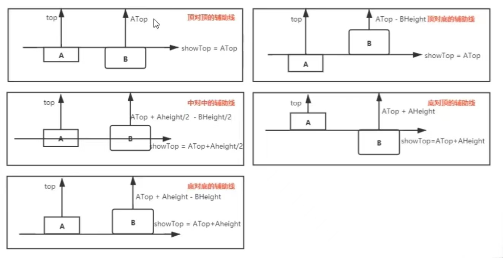

# low-code-v3

## Project setup

```
npm install
```

### Compiles and hot-reloads for development

```
npm run serve
```

### Compiles and minifies for production

```
npm run build
```

### Lints and fixes files

```
npm run lint
```

### Customize configuration

See [Configuration Reference](https://cli.vuejs.org/config/).

## 笔记

### 从一个模块拖拽到另一个模块中

H5 原生：draggable
onDragstart:拖拽开始时监听
dragenter：进入元素中加一个移动的标识

```js
e.dataTransfer.dropEffect = "move";
```

dragover：在目标元素经过，必须阻止默认行为，否则不能触发 drop

```js
e.preventDefault();
```

dragleave：离开元素的时候，需要增加一个禁用标识

```js
e.dataTransfer.dropEffect = "none";
```

drop：根据拖拽的组件，添加一个组件

onDragend:清除所有监听事件

### 拖拽松手后，鼠标在当前元素的中间

当前元素定位的计算

```js
top - offsetWidth / 2, left - offsetHeight / 2;
```

### 选中多元素进行拖拽

**设置聚焦、失焦数据**

```js
const focusData = computed(() => {
  let focusList = [];
  let blurList = [];
  data.value.blocks.forEach((block) =>
    (block.focus ? focusList : blurList).push(block)
  );
  return { focusList, blurList };
});
```

**按下 shift 键多选**

> Mousedown:e.shiftKey 进行失焦聚焦

```js
const blockMouseDown = (e, block, index) => {
  // 阻止mousedown默认行为
  e.preventDefault();
  // 阻止冒泡
  e.stopPropagation();
  if (e.shiftKey) {
    if (focusData.value.focusList.length <= 1) {
      block.focus = true;
    } else {
      block.focus = !block.focus;
    }
  } else {
    // 给每个元素添加是否聚焦
    if (!block.focus) {
      // 清除上一个焦点
      clearBlockFocus();
      block.focus = true;
    }
  }
  selectIndex.value = index;
  callback(e);
};
```

**设置一个位移数据**

```js
dragsState = {
  startX: e.clientX,
  startY: e.clientY,
  startPos: focusData.value.focusList.map(({ top, left }) => ({
    top,
    left,
  })),
};
```

**监听 mousemove**

> 计算元素位移

```js
const mousemove = (e) => {
  let { clientX: moveX, clientY: moveY } = e;
  let durX = moveX - dragsState.startX;
  let durY = moveY - dragsState.startY;
  focusData.value.focusList.forEach((block, idx) => {
      block.top = dragsState.startPos[idx].top + durY;
      block.left = dragsState.startPos[idx].left + durX;
});
```

};

**监听 mouseup**

> 清除所有监听事件

### 拖拽辅助线

> 辅助线对齐方式有 10 种

- top 为基准

  顶对顶
  顶对底
  中对中
  底对顶
  底对底

- left 为基准

  左对左
  右对左
  中对中
  右对右
  左对右

- 参考图
  
  

**设置辅助线数据**

- mousedown

```js
const { width: BWidth, height: BHeight } = lastSelectBlock.value;
dragsState = {
  startX: e.clientX,
  startY: e.clientY,
  startLeft: lastSelectBlock.value.left, // B点拖拽前的位置
  startTop: lastSelectBlock.value.top,
  startPos: focusData.value.focusList.map(({ top, left }) => ({
    top,
    left,
  })),
};
```

```js
// 辅助线数据
lines: (() => {
  const { blurList } = focusData.value;
  // 计算横线位置用y来存放，x存放纵线
  let lines = { x: [], y: [] };
  const blurData = [
    ...blurList,
    {
      top: 0,
      left: 0,
      width: data.value.container.width,
      height: data.value.container.height,
    },
  ];
  blurData.forEach((block) => {
    const {
      top: ATop,
      left: ALeft,
      width: AWidth,
      height: AHeight,
    } = block;
    // 当此元素拖拽到和A元素top一致时，要显示辅助线，辅助线位置就是ATop
    // 顶对顶
    lines.y.push({ showTop: ATop, top: ATop });
    // 顶对底
    lines.y.push({ showTop: ATop, top: ATop - BHeight });
    // 中对中
    lines.y.push({
      showTop: ATop + AHeight / 2,
      top: ATop + AHeight / 2 - BHeight / 2,
    });
    // 底对顶
    lines.y.push({ showTop: ATop + AHeight, top: ATop + AHeight });
    // 底对底
    lines.y.push({
      showTop: ATop + AHeight,
      top: ATop + AHeight - BHeight,
    });

    // 纵线
    // 左对左
    lines.x.push({ showLeft: ALeft, left: ALeft });
    // 右对左
    lines.x.push({ showLeft: ALeft + AWidth, left: ALeft + AWidth });
    //中对中
    lines.x.push({
      showLeft: ALeft + AWidth / 2,
      left: ALeft + AWidth / 2 - BWidth / 2,
    });
    // 右对右
    lines.x.push({
      showLeft: ALeft + AWidth,
      left: ALeft + AWidth - BWidth,
    });
    // 左对右
    lines.x.push({
      showLeft: ALeft,
      left: ALeft - BWidth,
    });
  });
  return lines;
})(),
```

- mousemove 开始计算 x/y 轴辅助线

```js
const mousemove = (e) => {
  let { clientX: moveX, clientY: moveY } = e;
  // 计算当前元素最新的left,top去线里面找到显示线
  // 鼠标移动后-鼠标移动前+left
  let left = moveX - dragsState.startX + dragsState.startLeft;
  let top = moveY - dragsState.startY + dragsState.startTop;
  // 先计算横线，距离参照物元素还有5像素时显示辅助线
  let y = null;
  let x = null;
  // x 轴线
  for (let i = 0; i < dragsState.lines.y.length; i++) {
    const { top: t, showTop: s } = dragsState.lines.y[i];
    if (Math.abs(t - top) < 5) {
      // 如果小于5说明横向接近
      y = s; // 辅助线显示位置
      moveY = dragsState.startY - dragsState.startTop + t; // 容器距顶部距离+目标的高度
      break;
    }
  }
  // y 轴线
  for (let i = 0; i < dragsState.lines.x.length; i++) {
    const { left: l, showLeft: s } = dragsState.lines.x[i];
    if (Math.abs(l - left) < 5) {
      // 如果小于5说明横向接近
      x = s; // 辅助线显示位置
      moveX = dragsState.startX - dragsState.startLeft + l; // 容器距顶部距离+目标的高度
      break;
    }
  }
  markLine.x = x;
  markLine.y = y;
  let durX = moveX - dragsState.startX;
  let durY = moveY - dragsState.startY;
  focusData.value.focusList.forEach((block, idx) => {
    block.top = dragsState.startPos[idx].top + durY;
    block.left = dragsState.startPos[idx].left + durX;
  });
};
```

- dom 画线

```jsx
{
  markLine.x !== null && (
    <div class="line-x" style={{ left: markLine.x + "px" }}></div>
  );
}
{
  markLine.y !== null && (
    <div class="line-y" style={{ top: markLine.y + "px" }}></div>
  );
}
```

```css
.line-x {
  position: absolute;
  top: 0;
  bottom: 0;
  border-left: 1px dashed #333;
}
.line-y {
  position: absolute;
  left: 0;
  right: 0;
  border-top: 1px dashed #333;
}
```

### 按钮操作设计

#### 1、按钮布局及样式

```jsx
<div className="editor-top">
  {buttons.map((btn) => {
    return (
      <div className="editor-top-button" onClick={btn.handler}>
        <i class={btn.icon}></i>
        <span>{btn.label}</span>
      </div>
    );
  })}
</div>
```

```css
&-top {
  position: absolute;
  right: 280px;
  left: 280px;
  height: 80px;
  display: flex;
  justify-content: center;
  align-items: center;
  .editor-top-button {
    width: 60px;
    height: 60px;
    display: flex;
    flex-direction: column;
    justify-content: center;
    align-items: center;
    background: rgba(0, 0, 0, 0.3);
    color: #fff;
    user-select: none;
    cursor: pointer;
    margin-left: 3px;
  }
}
```

```js
// 菜单按钮数据
const { commands } = useCommand(data);
const buttons = [
  {
    label: "撤销",
    icon: "icon iconfont icon-chexiao",
    handler: () => commands.undo(),
  },
  {
    label: "重做",
    icon: "icon iconfont icon-redo",
    handler: () => commands.redo(),
  },
];
```

#### 2、实现命令注册

- 注册

```js
const state = {
  current: -1, // 前进后退索引
  queue: [], // 存放所有的操作命令
  commands: {}, // 制作命令和执行功能一个映射表
  commandArray: [], // 存放所有命令
  destoryArray: [],
};
const registry = (command) => {
  state.commandArray.push(command);
  state.commands[command.name] = () => {
    // 命令名字对应执行函数
    const { redo, undo } = command.execute();
    redo();
    if (!command.pushQueue) {
      return;
    }
    let { queue, current } = state;
    if (queue.length > 0) {
      queue = queue.slice(0, current + 1);
      state.queue = queue;
    }

    queue.push({ redo, undo });
    state.current = current + 1;
  };
};
```

#### 3、实现拖拽菜单撤回、重做功能

```js
// 重做
registry({
  name: "redo",
  keyboard: "ctr+y",
  execute() {
    return {
      redo() {
        let item = state.queue[state.current + 1];
        if (item) {
          item.redo && item.redo();
          state.current++;
        }
      },
    };
  },
});
```

```js
// 撤销
registry({
  name: "undo",
  keyboard: "ctr+z",
  execute() {
    return {
      redo() {
        if (state.current === -1) return;
        let item = state.queue[state.current];
        if (item) {
          item.undo && item.undo();
          state.current--;
        }
      },
    };
  },
});
```

```js
// 注册拖拽
registry({
  // 如果将操作放到队列中可以增加一个属性标识，等会操作要放到队列中
  name: "drag",
  pushQueue: true,
  init() {
    // 初始化默认会执行
    this.before = null;
    // 监控拖拽开始事件，保存状态
    const start = () =>
      (this.before = JSON.parse(JSON.stringify(data.value.blocks)));
    // 拖拽之后需要触发对应的指令
    const end = () => state.commands.drag();
    events.on("start", start);
    events.on("end", end);
    return () => {
      events.off("start", start);
      events.off("end", end);
    };
  },
  execute() {
    let before = this.before;
    let after = data.value.blocks;
    return {
      redo() {
        // 松手直接把当前事情做了
        data.value = { ...data.value, blocks: after };
      },
      undo() {
        data.value = { ...data.value, blocks: before };
      },
    };
  },
});
```

#### 4、实现组件拖拽撤回、重做功能

- 从预览区到渲染区拖拽多次后再撤销，重做

```js
// 预览区添加触发事件
const dragstart = (e, com) => {
  containerRef.value.addEventListener("dragenter", dragEnter);
  containerRef.value.addEventListener("dragover", dragOver);
  containerRef.value.addEventListener("dragleave", dragLeave);
  containerRef.value.addEventListener("drop", drop);
  currentCom = com;
  events.emit("start");
};
const dragend = () => {
  containerRef.value.removeEventListener("dragenter", dragEnter);
  containerRef.value.removeEventListener("dragover", dragOver);
  containerRef.value.removeEventListener("dragleave", dragLeave);
  containerRef.value.removeEventListener("drop", drop);
  events.emit("end");
};
```

- 在渲染区拖拽多次后再撤销，重做
  > 注册拖拽状态

```js
let dragsState = {
  startX: 0,
  startY: 0,
  dragging: false, // 默认不是在拖拽
};
```

> mousemove，mouseup 时添加触发事件，
> 安装 mitt

```js
// 封装一个event事件
import mitt from "mitt";
export const events = mitt();
```

```js
import { events } from "./events";
const mousemove = (e) => {
  if (!dragsState.dragging) {
    dragsState.dragging = true;
    events.emit("start");
  }
};
```

```js
const mouseup = () => {
  if (dragsState.dragging) {
    events.emit("end");
  }
};
```

- 键盘快捷键实现撤销(ctr+z)，重做(ctr+y)

> 键盘功能

```js
const keyboardEvent = (() => {
  const keyCodes = {
    90: "z",
    89: "y",
  };
  const onKeydown = (e) => {
    const { ctrlKey, keyCode } = e; // ctrlKey:true keyCode:90
    let keyString = [];
    if (ctrlKey) keyString.push("ctr");

    keyString.push(keyCodes[keyCode]);
    keyString = keyString.join("+"); // // ctr+z, ctr+y

    state.commandArray.forEach(({ keyboard, name }) => {
      if (!keyboard) return;
      if (keyboard === keyString) {
        state.commands[name]();
        e.preventDefault();
      }
    });
  };
  const init = () => {
    window.addEventListener("keydown", onKeydown);
    return () => {
      window.removeEventListener("keydown", onKeydown);
    };
  };
  return init;
})();
```

#### 6、实现导入导出功能

**实现 dialog 组件**

```js
const DialogComponent = defineComponent({
  props: {
    option: { type: Object },
  },

  setup(props, ctx) {
    const state = reactive({
      option: props.option,
      isShow: false,
    });
    ctx.expose({
      showDialog(option) {
        state.option = option;
        // 让外面可以调用
        state.isShow = true;
      },
    });
    const onCancel = () => {
      state.isShow = false;
    };
    const onConfirm = () => {
      state.isShow = false;
      state.option.onConfirm && state.option.onConfirm(state.option.content);
    };
    return () => {
      return (
        <ElDialog v-model={state.isShow} title={state.option.title}>
          {{
            default: () => (
              <ElInput
                type="textarea"
                v-model={state.option.content}
                rows={10}></ElInput>
            ),
            footer: () =>
              state.option.footer && (
                <div>
                  <ElButton onClick={onCancel}>取消</ElButton>
                  <ElButton type="primary" onClick={onConfirm}>
                    确定
                  </ElButton>
                </div>
              ),
          }}
        </ElDialog>
      );
    };
  },
});
```

```js
// 手动实现原生组件挂载
let vm;
export function $dialog(option) {
  // 手动挂载组件
  if (!vm) {
    let el = document.createElement("div");
    vm = createVNode(DialogComponent, { option }); // 将组件渲染成虚拟节点
    document.body.appendChild((render(vm, el), el)); // 渲染成真实节点为到页面中
  }

  // 将组件渲染到这个el元素上
  let { showDialog } = vm.component.exposed;
  showDialog(option);
}
```

**导入后支持撤回功能**
注册功能中加入传参 args

```js
const registry = (command) => {
  state.commandArray.push(command);
  // 注册不同功能时传参并导出传参
  state.commands[command.name] = (...args) => {
    // 命令名字对应执行函数
    const { redo, undo } = command.execute(...args);
    redo();
    if (!command.pushQueue) {
      return;
    }
    let { queue, current } = state;
    if (queue.length > 0) {
      queue = queue.slice(0, current + 1);
      state.queue = queue;
    }

    queue.push({ redo, undo });
    state.current = current + 1;
  };
};
```

```js
// 带有历史记录
registry({
  name: "updateContainer",
  pushQueue: true,
  // 导出传参，记录为新参
  execute(newValue) {
    let state = {
      before: data.value,
      after: newValue,
    };
    return {
      redo: () => {
        data.value = state.after;
      },
      undo: () => {
        data.value = state.before;
      },
    };
  },
});
```

```js
{
  label: "导出",
  icon: "icon iconfont icon-export",
  handler: () => {
    $dialog({
      title: "导出json使用",
      content: JSON.stringify(data.value),
    });
  },
},
{
  label: "导入",
  icon: "icon iconfont icon-import",
  handler: () => {
    $dialog({
      title: "导入json使用",
      content: "",
      footer: true,
      onConfirm(text) {
        // 注册中加入传参
        commands.updateContainer(JSON.parse(text));
      },
    });
  },
},

```

### 实现置顶、置底功能

**置顶实现**

```js
registry({
  name: "placeTop",
  pushQueue: true,
  execute() {
    let state = {
      before: JSON.parse(JSON.stringify(data.value.blocks)),
      after: (() => {
        // 找出渲染块中顶级最大的
        let { focusList, blurList } = focusData.value;
        // console.log(focusList, blurList, "focusData");
        let maxZIndex = blurList.reduce((prev, block) => {
          return Math.max(prev, block.zIndex);
        }, -Infinity);
        focusList.forEach((block) => (block.zIndex = maxZIndex + 1));
        return data.value.blocks;
      })(),
    };
    return {
      redo: () => {
        data.value = { ...data.value, blocks: state.after };
      },
      undo: () => {
        data.value = { ...data.value, blocks: state.before };
      },
    };
  },
});
```

**置底实现**

```js
registry({
  name: "placeBottom",
  pushQueue: true,
  execute() {
    let state = {
      before: JSON.parse(JSON.stringify(data.value.blocks)),
      after: (() => {
        // 找出渲染块中顶级最大的
        let { focusList, blurList } = focusData.value;
        // console.log(focusList, blurList, "focusData");
        let minZIndex =
          blurList.reduce((prev, block) => {
            return Math.min(prev, block.zIndex);
          }, Infinity) - 1;
        const min = Math.abs(minZIndex);
        if (minZIndex < 0) {
          minZIndex = 0;
          blurList.forEach((block) => (block.zIndex += min));
        }
        focusList.forEach((block) => (block.zIndex = minZIndex));
        return data.value.blocks;
      })(),
    };
    return {
      redo: () => {
        data.value = { ...data.value, blocks: state.after };
      },
      undo: () => {
        data.value = { ...data.value, blocks: state.before };
      },
    };
  },
});
```

置顶、置底的配置

```js
{
  label: "置顶",
  icon: "icon iconfont icon-control-top",
  handler: () => commands.placeTop(),
},
{
  label: "置底",
  icon: "icon iconfont icon-zhidi1",
  handler: () => commands.placeBottom(),
},
```

### 实现删除功能

```js
// 删除配置
{
  label: "删除",
  icon: "icon iconfont icon-delete",
  handler: () => commands.delete(),
}
```

```js
// 删除注册
registry({
  name: "delete",
  pushQueue: true,
  execute() {
    let state = {
      before: data.value.blocks,
      after: focusData.value.blurList,
    };
    return {
      redo: () => {
        data.value = { ...data.value, blocks: state.after };
      },
      undo: () => {
        data.value = { ...data.value, blocks: state.before };
      },
    };
  },
});
```

### 预览、编辑

> 预览状态下不能拖拽，不能选中
> 编辑状态下可拖拽，可选中

```js
// 设置预览响应式数据
const previewRef = ref(false);
// 配置
{
  label: () => (previewRef.value ? "编辑" : "预览"),
  icon: () =>
    previewRef.value
      ? "icon iconfont icon-tianxie"
      : "icon iconfont icon-yulan",
  handler: () => {
    previewRef.value = !previewRef.value;
    clearBlockFocus();
  },
},

```

按钮菜单栏需要重新设置

```jsx
<div className="editor-top">
  {buttons.map((btn) => {
    const icon = typeof btn.icon === "function" ? btn.icon() : btn.icon;
    const label = typeof btn.label === "function" ? btn.label() : btn.label;
    return (
      <div className="editor-top-button" onClick={btn.handler}>
        <i class={icon}></i>
        <span>{label}</span>
      </div>
    );
  })}
</div>
```

将 previewRef 响应式数据传递给 useFocus,在 mousedown 事件时停止拖拽

```js
const {
  containerMousedown,
  focusData,
  blockMouseDown,
  lastSelectBlock,
  clearBlockFocus,
} = useFocus(data, previewRef, (e) => {
  mousedown(e);
});
```

```js
// useFocus.js
const containerMousedown = () => {
    if (previewRef.value) return;
    clearBlockFocus();
    selectIndex.value = -1;
  };
}
const blockMouseDown = (e, block, index) => {
  if (previewRef.value) return;
}
```

### 关闭，返回

> 点击关闭，只显示渲染区，在渲染区返回，再进入到关闭前的状态

```js
const edtionRef = ref(true);
// 配置数据
{
  label: "关闭",
  icon: "icon iconfont icon-guanbi",
  handler: () => {
    edtionRef.value = false;
    clearBlockFocus();
  },
},

```

dom 部分

```jsx
return () =>
  !edtionRef.value ? (
    <>
      <div
        className="editor-container-canvas_content"
        style={{ ...containerStyle.value, margin: 0 }}>
        {data.value.blocks.map((item) => (
          <EditorBlock
            class="editor-block-preview"
            block={item}></EditorBlock>
        ))}
        <ElButton type="primary" onClick={() => (edtionRef.value = true)}>
          返回
        </ElButton>
      </div>
    </>
  ) : (）
```

### 渲染区右键菜单

#### 设计右键菜单

> 在渲染区，右击每一个模块时，显示自定义右键菜单：删除，置顶，置底，果看，导入
> 菜单右击原生事件 **onContextmenu**

```jsx
<EditorBlock onContextmenu={(e) => onRightClickMenu(e, item)}></EditorBlock>
```

**封装 dropDown**

- 封装 DropDown 组件

```js
// 封装DropDown组件
export const DropDownComponent = defineComponent({
  props: {
    option: { type: Object },
  },
  setup(props, ctx) {
    const state = reactive({
      option: props.option,
      isShow: false,
      top: 0,
      left: 0,
    });
    ctx.expose({
      showDropdown(option) {
        state.option = option;
        state.isShow = true;
        let { top, left, height } = option.el.getBoundingClientRect();
        state.top = top + height;
        state.left = left;
      },
    });
    // 父元素注入数据
    provide("hide", () => (state.isShow = false));

    const classes = computed(() => [
      "dropdown",
      {
        "dropdown-isShow": state.isShow,
      },
    ]);
    const styles = computed(() => ({
      top: state.top + "px",
      left: state.left + "px",
    }));

    const el = ref(null);
    const onMousedown = (e) => {
      if (!el.value.contains(e.target)) {
        state.isShow = false;
      }
    };
    onMounted(() => {
      // 事件传递行为是先捕获再冒泡
      document.body.addEventListener("mousedown", onMousedown, true);
    });

    onBeforeUnmount(() => {
      document.body.removeEventListener("mousedown", onMousedown);
    });
    return () => {
      return (
        <div class={classes.value} style={styles.value} ref={el}>
          {state.option.content()}
        </div>
      );
    };
  },
});
```

- 创建原生渲染组件

```js
let vm;
export function $dropDown(option) {
  // 手动挂载组件
  if (!vm) {
    let el = document.createElement("div");
    vm = createVNode(DropDownComponent, { option }); // 将组件渲染成虚拟节点
    document.body.appendChild((render(vm, el), el)); // 渲染成真实节点为到页面中
  }

  // 将组件渲染到这个el元素上
  let { showDropdown } = vm.component.exposed;
  showDropdown(option);
}
```

- 封装子组件 dropDownitem

```js
export const DropdownItem = defineComponent({
  props: {
    label: String,
    icon: String,
  },
  setup(props) {
    // eslint-disable-next-line vue/no-setup-props-destructure
    let { label, icon } = props;
    // 子元素接收数据
    let hide = inject("hide");
    return () => (
      <div class="dropdown-item" onClick={hide}>
        <i class={`icon iconfont ${icon}`} style="margin-right:3px;"></i>
        <span>{label}</span>
      </div>
    );
  },
});
```

```css
.dropdown {
  display: none;
  position: absolute;
  background: #fff;
  box-shadow: 2px 2px #ccc;
}
.dropdown-isShow {
  display: block;
}
.dropdown-item {
  line-height: 30px;
  width: 100px;
  border-bottom: 1px solid #ccc;
  text-align: center;
  user-select: none;
  cursor: pointer;
}
```

**右键触发事件**

- 注册只导入当前模块数据

```js
// 更新某一个渲染模块
registry({
  name: "updateBlock",
  pushQueue: true,
  execute(newValue, oldValue) {
    let state = {
      before: data.value.blocks,
      after: (() => {
        let blocks = [...data.value.blocks];
        const index = data.value.blocks.indexOf(oldValue);
        if (index > -1) {
          blocks.splice(index, 1, newValue);
        }
        return blocks;
      })(),
    };
    return {
      redo: () => {
        data.value = { ...data.value, blocks: state.after };
      },
      undo: () => {
        data.value = { ...data.value, blocks: state.before };
      },
    };
  },
});
```

- 封装右击事件显示菜单功能

```js
const onRightClickMenu = (e, block) => {
  e.preventDefault();

  $dropDown({
    el: e.target,
    content: () => (
      <>
        <DropdownItem
          label="删除"
          icon="icon-delete"
          onClick={() => commands.delete()}></DropdownItem>
        <DropdownItem
          label="置顶"
          icon="icon-control-top"
          onClick={() => commands.placeTop()}></DropdownItem>
        <DropdownItem
          label="置底"
          icon="icon-zhidi1"
          onClick={() => commands.placeBottom()}></DropdownItem>
        <DropdownItem
          label="查看"
          icon="icon-yulan"
          onClick={() => {
            $dialog({
              title: "查看节点数据",
              content: JSON.stringify(block),
            });
          }}></DropdownItem>
        <DropdownItem
          label="导入"
          icon="icon-import"
          onClick={() => {
            $dialog({
              title: "导入节点数据",
              content: "",
              footer: true,
              onConfirm(text) {
                commands.updateBlock(JSON.parse(text), block);
              },
            });
          }}></DropdownItem>
      </>
    ),
  });
};
```
